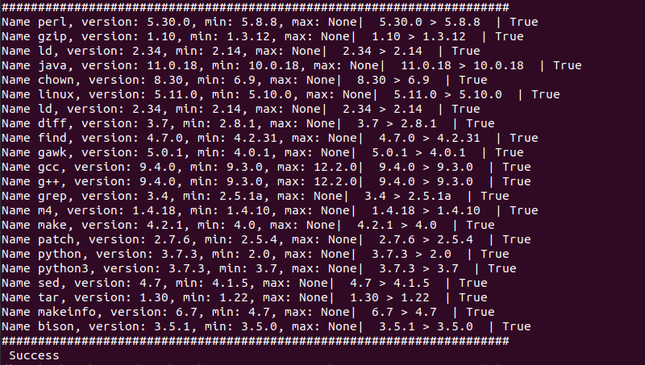

### Tools script to list version numbers of critical development tools

#### Python Versions >=3.8

## What can it do?
You can get version information and is the version in the range you need:
- version perl
- version gzip
- version ld
- version java
- version chown
- version linux
- version ld
- version diff
- version find
- version gawk
- version gcc
- version g++,
- version grep
- version m4
- version make
- version patch
- version python
- version python3
- version sed
- version tar
- version makeinfo
- version bison

#### At your discretion, you can change the versions or add a checklist
